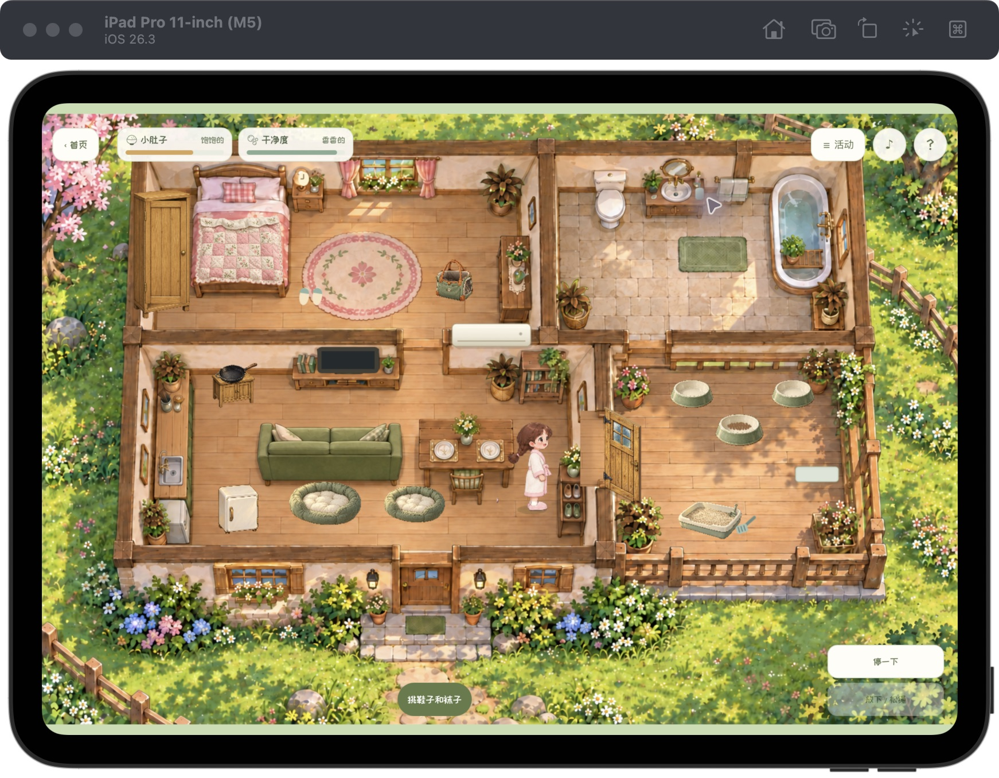

# 暖暖的小农场 · iPad 独立版

种种菜，摸摸猫，肚子咕咕叫就回家吃饭。带着暖暖过一个慢悠悠的小日子吧！



这是暖暖的小农场的独立 iPad 工程，包含完整游戏代码和离线素材。运行和构建不依赖原网页版，也不会自动同步或修改网页版。

## 已实现

- 苹果原生 SwiftUI 首页、系统启动屏、游戏图标、玩法说明和关于页面。
- 首页与玩法说明使用简短儿童文案；标题与按钮使用随包提供的站酷快乐体，菜单图标使用 Noto Emoji 线描字体。来源和 OFL 许可保存在 `Game/fonts`，离线无需下载字体。
- 本地 WKWebView + 苹果官方 WKURLSchemeHandler 加载完整游戏及图片、录音，离线游玩，不需要 Mac 服务。统一资源来源并为图片提供 CORS 响应，支持鞋袜换色和冬景的 Canvas 像素处理。
- 原生首页支持横竖屏；进入游戏默认横屏，全屏画布、悬浮菜单与触摸操作，移除底部常驻说明。完整比例显示原画，主要按钮不少于 44pt。
- 点地面寻路，方向键与小跑按钮在 iPad 隐藏。保留钓鱼收线、秋千用力、结束动作、放下宠物或松绳，下面的动作区域按需出现。
- 左上角「小肚子」「干净度」两条轻量状态，与首页并排，不抢触摸。小肚子初始 80/100，随活动消耗，吃饭 +60、面包 +35、水果 +20、冰淇淋 +10、冰沙 +5；饭桌用餐完成才补充。饿了只提醒，不强制中断动作。干净度 = 100 − 脏污值，洗澡后恢复。两项跟随生活存档，旧存档的小肚子从 80 起步。
- 回首页和切到后台暂停时间与声音，回首页后进入保留当前会话。
- 每五秒尝试在动作完成后保存生活状态；返回首页或后台也会尝试保存。存档原子写入本机 Documents。未完成的做饭、洗澡、诊疗、睡眠等动作不会产生半成品存档，完全关闭后从最近的完整检查点恢复。
- 存档包括背包与食物批次、日期天气、衣服被子鞋袜、位置、动物成长和喂养、宠物位置与健康/药物疗程、朋友关系、盆栽、图鉴及冰箱/饭桌库存。场景临时动画与 NPC 随机走动不序列化。

## 在 Xcode 中运行

克隆仓库后打开工程：

```sh
git clone https://github.com/Domn93/nuannuan-farm-ipad.git
cd nuannuan-farm-ipad/iPadApp
open NuannuanFarm.xcodeproj
```

1. 用完整 Xcode 打开 `NuannuanFarm.xcodeproj`。
2. 选择 `NuannuanFarm` Scheme，运行目标选一台 iPad 模拟器，点击 ▶︎。
3. 安装到真机：连接 iPad，选择项目 → NuannuanFarm Target → Signing & Capabilities → Team，选择自己的 Apple 账户团队。按设备提示信任 Mac、启用开发者模式，目标选该 iPad，点击 ▶︎。
4. 如果签名提示 Bundle Identifier 已被占用，把 `com.nuannuan.farm` 改为自己唯一的标识。改变标识会创建独立 App 和存档空间。

最低系统为 iPadOS 17，设备系列仅 iPad。免费 Personal Team 的设备签名通常七天到期，需要重新安装；TestFlight / App Store 发布需 Apple Developer Program 会员与实际分发审核。

已按较小款 **11 英寸 iPad Pro** 验收。游戏请横着拿 iPad；首页横竖屏都能显示。iPadOS 26 的窗口模式仍由系统管理，如果 App 出现在窗口中，用系统窗口菜单切换全屏。画面保持原比例，避免人物和房屋被拉宽。

## 命令行构建与检查

```sh
node tests/ipad-check.cjs
node tests/audio-check.cjs
./scripts/build.sh simulator
./scripts/build.sh archive
./scripts/regression.sh <已启动的 iPad 模拟器 UUID>
```

脚本优先使用 `/Applications/Xcode.app`，也支持目前「下载」目录里的 Xcode；可以通过 `DEVELOPER_DIR` 指定其他安装位置。不改变系统的 `xcode-select` 设置。

模拟器包：`build/DerivedData/Build/Products/Debug-iphonesimulator/NuannuanFarm.app`。

真机归档：`build/NuannuanFarm.xcarchive`。此命令产生**未签名归档**，可复核真机架构和资源；它不是能直接安装的 IPA。真机安装或分发请在 Xcode 选择有效团队后重新构建、Archive 和导出。

## 文件组织

| 路径 | 用途 |
| --- | --- |
| `NuannuanFarm.xcodeproj` | 可直接打开的 Xcode 工程，共享运行 Scheme |
| `NuannuanFarm/FarmRootView.swift` | 原生首页、玩法说明和关于页面 |
| `NuannuanFarm/GameController.swift` | 本地加载、暂停、存档、错误恢复 |
| `NuannuanFarm/LaunchScreen.storyboard` | 系统启动屏 |
| `NuannuanFarm/Game` | 独立游戏和素材副本 |
| `Game/css/ipad.css`、`Game/js/ipad*.js` | App 布局、触屏和生活存档 |
| `scripts` | 可重复构建和原创图标生成 |
| `tests` | App 存档、状态边界和资源完整性检查 |

生活存档只保存在设备，不做云同步；卸载 App 会删除它。素材许可及来源保留在 `Game/assets` 原有 README 中。正式公开发布前仍需核对素材许可和 App Store 的作品要求。

回归范围、修复记录和验证限制见 `QA.md`，真实 WebKit 测试结果保存在 `qa/regression-latest.json`。

技术依据：[WKURLSchemeHandler 本地资源加载](https://developer.apple.com/documentation/webkit/wkurlschemehandler)、[SwiftUI UIViewRepresentable](https://developer.apple.com/documentation/swiftui/uiviewrepresentable)、[苹果设备签名说明](https://developer.apple.com/help/account/basics/about-your-developer-account)。

仅在 Debug 包中，`xcrun simctl launch <模拟器 UUID> com.nuannuan.farm --regression --performance` 可以单独重复 18 组真实动画帧采样；此模式不读写玩家生活存档。结果写入模拟器 App 的 `Documents/farm-regression.json`，单独性能运行会替换该设备上的上一份测试报告，项目 `qa` 中保存的完整回归报告不受影响。
